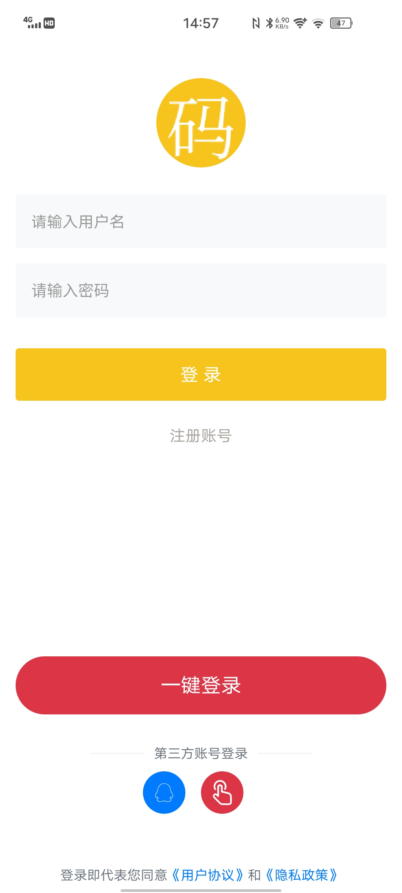
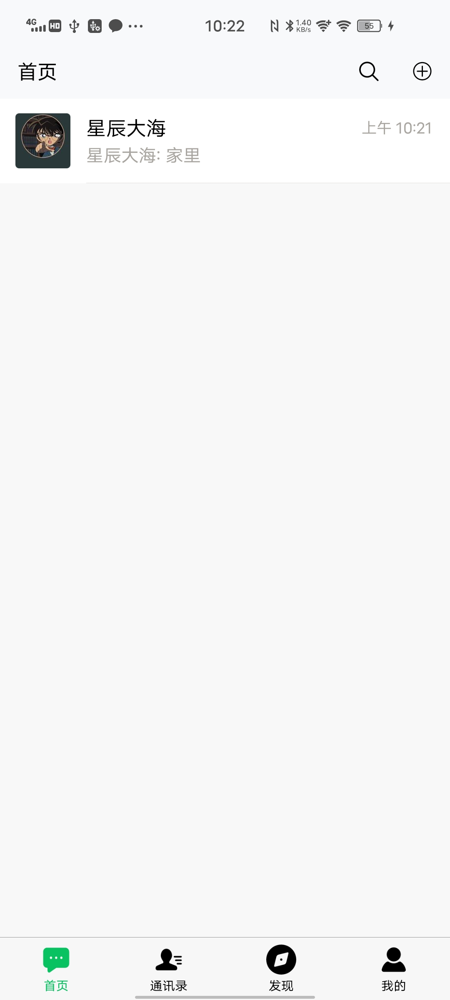
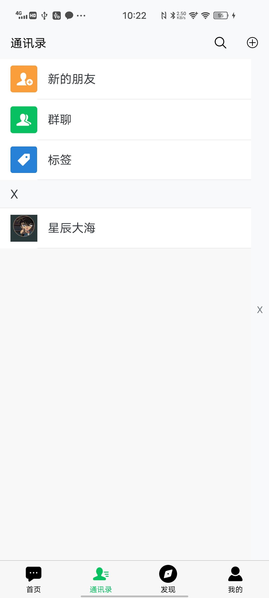
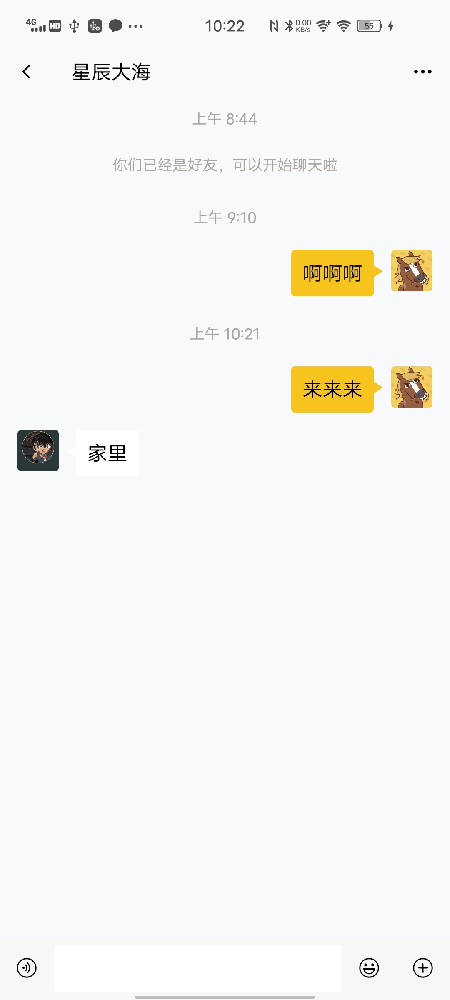
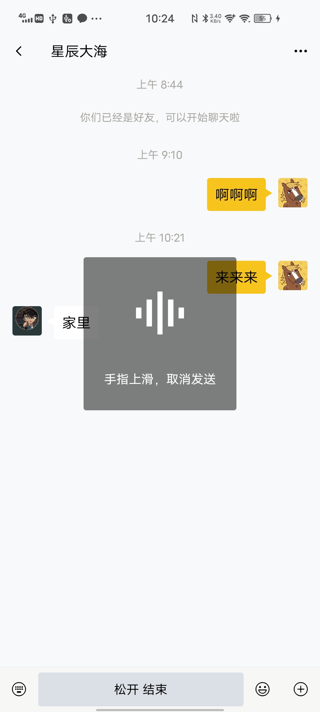
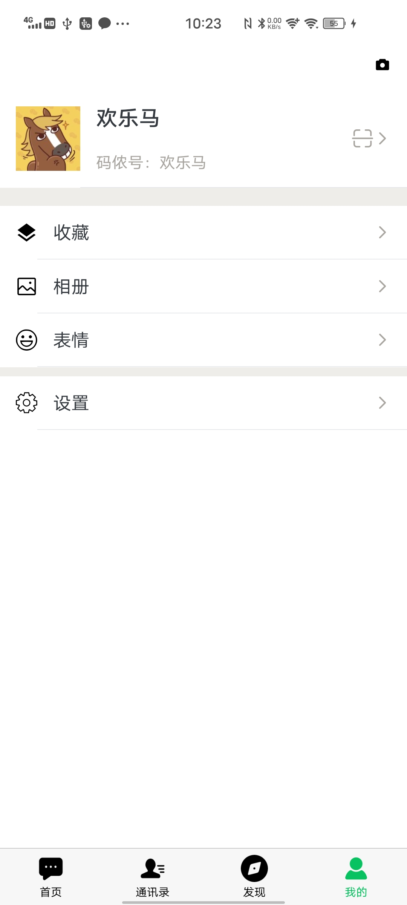

# 吾聊

最新修改 开源项目

类似于微信聊天，H5端调整可以用来做客服聊天系统，

App端调整可以做代理之间的聊天系统。

> 吾聊是一套基于uniapp+uniCloud+node.js  websocket之间通讯
>
> 纯nvue项目开发的聊天软件，发送文字和语音，动态朋友圈，
>
> 添加好友，断线重连，好友列表，收藏，扫一扫添加好友。
>
> qq登录、一键登录
>
> 聊天（单聊，群聊）聊天置顶、发起群聊
>
> 消息 发送文字、图片、语音、表情，消息撤回
>
> 好友备注，推荐，标星朋友，黑名单，删除好友，扫一扫
>
> 发布动态 文字，图文，短视频，点赞和评论
>
> 我的主页 收藏管理，二维码，动态管理

## 支持组件

- 基础组件：角标、头像、导航栏、图片
- 定义组件：消息列表、聊天列表、朋友圈动态列表

## Android扫码下载

